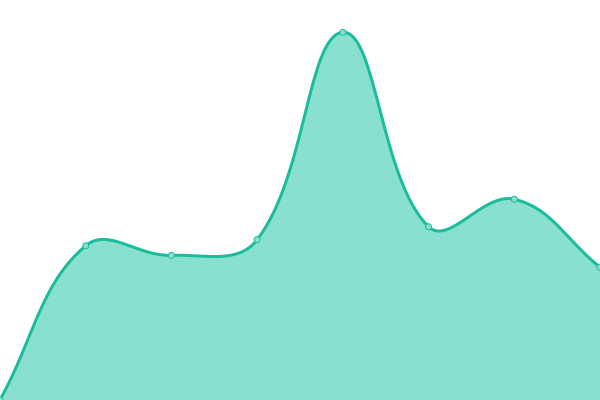
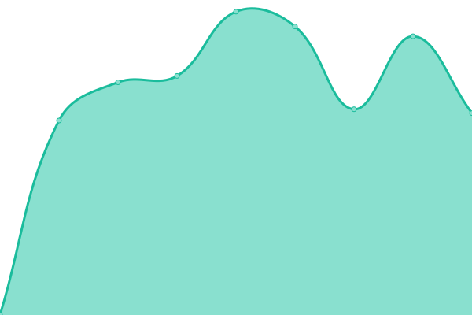
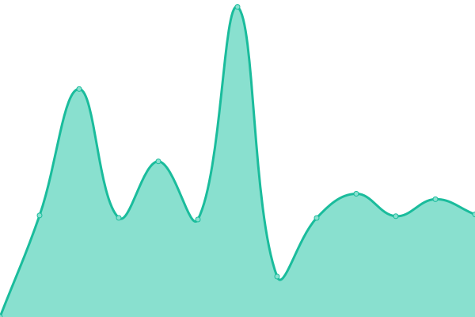

# [Status page](https://tiktok-status.evelode.com) for [TikTok REST API](https://evelode.com/downloads/tiktok-rest-api/)

This repository contains the open-source uptime monitor and status page for [Evelode](https://evelode.com), powered by [Upptime](https://github.com/upptime/upptime).

Starting with the [TikTok REST API](https://evelode.com/downloads/tiktok-rest-api/) – you have access to an extensive ecosystem to accelerate your development process. Built for large scale crawling, low latency high availability. Get TikTok public user data, feed, trends, hashtags, music, and non-watermarked TikTok videos.

Using our detailed multipurpose documentation you can explore and reach all TikTok REST API endpoints with ease.

Try our [Trial license plan](https://evelode.com/downloads/tiktok-rest-api/) and test all API endpoints before buying a license.

## Quick Start

We created a modern API wrappers with detailed examples:

- [TikTok REST API in Postman](https://www.postman.com/evelode/workspace/evelode/api/e2ed8e20-0dbd-41a3-9363-092d810217ed?action=share&creator=24862082)
- [TikTok REST API wrapper for PHP on GitHub](https://github.com/evelode/tiktok-api-php)

## Choose the right plan for you

Find a plan that best matches the scale you need for your application.

## [Live Status](https://tiktok-status.evelode.com): <!--live status--> **🟩 All systems operational**

<!--start: status pages-->
<!-- This summary is generated by Upptime (https://github.com/upptime/upptime) -->
<!-- Do not edit this manually, your changes will be overwritten -->
<!-- prettier-ignore -->
| URL | Status | History | Response Time | Uptime |
| --- | ------ | ------- | ------------- | ------ |
|  /getNoWatermarkUrl - Get non watermarked video url | 🟩 Up | [get-no-watermark-url-get-non-watermarked-video-url.yml](https://github.com/evelode/tiktok-status/commits/HEAD/history/get-no-watermark-url-get-non-watermarked-video-url.yml) | 

 3508ms
     
 | 

<a href="https://tiktok-status.evelode.com/history/get-no-watermark-url-get-non-watermarked-video-url">99.75%</a>
    

|  /getNoWatermarkUrlByID - Get non watermarked video url by video ID | 🟩 Up | [get-no-watermark-url-by-id-get-non-watermarked-video-url-by-video-id.yml](https://github.com/evelode/tiktok-status/commits/HEAD/history/get-no-watermark-url-by-id-get-non-watermarked-video-url-by-video-id.yml) | 

 2674ms
     
 | 

<a href="https://tiktok-status.evelode.com/history/get-no-watermark-url-by-id-get-non-watermarked-video-url-by-video-id">100.00%</a>
    

|  /getVideoByID - Get video info by ID | 🟩 Up | [get-video-by-id-get-video-info-by-id.yml](https://github.com/evelode/tiktok-status/commits/HEAD/history/get-video-by-id-get-video-info-by-id.yml) | 

 1724ms
     
 | 

<a href="https://tiktok-status.evelode.com/history/get-video-by-id-get-video-info-by-id">100.00%</a>
    

|  /getVideoByUrl - Get video info by URL | 🟩 Up | [get-video-by-url-get-video-info-by-url.yml](https://github.com/evelode/tiktok-status/commits/HEAD/history/get-video-by-url-get-video-info-by-url.yml) | 

 1735ms
     
 | 

<a href="https://tiktok-status.evelode.com/history/get-video-by-url-get-video-info-by-url">100.00%</a>
    

|  /getUnshortenedUrl - Convert short TikTok video URL to full TikTok video URL | 🟩 Up | [get-unshortened-url-convert-short-tik-tok-video-url-to-full-tik-tok-video-url.yml](https://github.com/evelode/tiktok-status/commits/HEAD/history/get-unshortened-url-convert-short-tik-tok-video-url-to-full-tik-tok-video-url.yml) | 

 2372ms
     
 | 

<a href="https://tiktok-status.evelode.com/history/get-unshortened-url-convert-short-tik-tok-video-url-to-full-tik-tok-video-url">100.00%</a>
    

|  /getCommentsByUrl - Get comments list by video URL | 🟩 Up | [get-comments-by-url-get-comments-list-by-video-url.yml](https://github.com/evelode/tiktok-status/commits/HEAD/history/get-comments-by-url-get-comments-list-by-video-url.yml) | 

 1637ms
     
 | 

<a href="https://tiktok-status.evelode.com/history/get-comments-by-url-get-comments-list-by-video-url">100.00%</a>
    

|  /getCommentsByID - Get comments list by video ID | 🟩 Up | [get-comments-by-id-get-comments-list-by-video-id.yml](https://github.com/evelode/tiktok-status/commits/HEAD/history/get-comments-by-id-get-comments-list-by-video-id.yml) | 

 1540ms
     
 | 

<a href="https://tiktok-status.evelode.com/history/get-comments-by-id-get-comments-list-by-video-id">100.00%</a>
    

|  /searchUser - Search for user by keyword | 🟩 Up | [search-user-search-for-user-by-keyword.yml](https://github.com/evelode/tiktok-status/commits/HEAD/history/search-user-search-for-user-by-keyword.yml) | 

 1655ms
     
 | 

<a href="https://tiktok-status.evelode.com/history/search-user-search-for-user-by-keyword">100.00%</a>
    

|  /searchVideo - Search for video by keyword | 🟩 Up | [search-video-search-for-video-by-keyword.yml](https://github.com/evelode/tiktok-status/commits/HEAD/history/search-video-search-for-video-by-keyword.yml) | 

 3268ms
     
 | 

<a href="https://tiktok-status.evelode.com/history/search-video-search-for-video-by-keyword">100.00%</a>
    

|  /searchMusic - Search for music by keyword | 🟩 Up | [search-music-search-for-music-by-keyword.yml](https://github.com/evelode/tiktok-status/commits/HEAD/history/search-music-search-for-music-by-keyword.yml) | 

 1786ms
     
 | 

<a href="https://tiktok-status.evelode.com/history/search-music-search-for-music-by-keyword">100.00%</a>
    

|  /searchLive - Search for live by keyword | 🟩 Up | [search-live-search-for-live-by-keyword.yml](https://github.com/evelode/tiktok-status/commits/HEAD/history/search-live-search-for-live-by-keyword.yml) | 

 2960ms
     
 | 

<a href="https://tiktok-status.evelode.com/history/search-live-search-for-live-by-keyword">100.00%</a>
    

|  /searchHashtag - Search for hashtag by keyword | 🟩 Up | [search-hashtag-search-for-hashtag-by-keyword.yml](https://github.com/evelode/tiktok-status/commits/HEAD/history/search-hashtag-search-for-hashtag-by-keyword.yml) | 

 1258ms
     
 | 

<a href="https://tiktok-status.evelode.com/history/search-hashtag-search-for-hashtag-by-keyword">100.00%</a>
    

|  /searchLocation - Search for location by keyword | 🟩 Up | [search-location-search-for-location-by-keyword.yml](https://github.com/evelode/tiktok-status/commits/HEAD/history/search-location-search-for-location-by-keyword.yml) | 

 1475ms
     
 | 

<a href="https://tiktok-status.evelode.com/history/search-location-search-for-location-by-keyword">100.00%</a>
    

|  /getUserInfo - Get user info by profile URL or nickname | 🟩 Up | [get-user-info-get-user-info-by-profile-url-or-nickname.yml](https://github.com/evelode/tiktok-status/commits/HEAD/history/get-user-info-get-user-info-by-profile-url-or-nickname.yml) | 

 3394ms
     
 | 

<a href="https://tiktok-status.evelode.com/history/get-user-info-get-user-info-by-profile-url-or-nickname">100.00%</a>
    

|  /getUserInfoByID - Get user info by profile ID | 🟩 Up | [get-user-info-by-id-get-user-info-by-profile-id.yml](https://github.com/evelode/tiktok-status/commits/HEAD/history/get-user-info-by-id-get-user-info-by-profile-id.yml) | 

 1063ms
     
 | 

<a href="https://tiktok-status.evelode.com/history/get-user-info-by-id-get-user-info-by-profile-id">100.00%</a>
    

|  /getBasicUserInfo - Get user info by profile ID | 🟩 Up | [get-basic-user-info-get-user-info-by-profile-id.yml](https://github.com/evelode/tiktok-status/commits/HEAD/history/get-basic-user-info-get-user-info-by-profile-id.yml) | 

 2462ms
     
 | 

<a href="https://tiktok-status.evelode.com/history/get-basic-user-info-get-user-info-by-profile-id">99.77%</a>
    

|  /getUserFeed - Get user feed by profile URL or nickname | 🟩 Up | [get-user-feed-get-user-feed-by-profile-url-or-nickname.yml](https://github.com/evelode/tiktok-status/commits/HEAD/history/get-user-feed-get-user-feed-by-profile-url-or-nickname.yml) | 

 2796ms
     
 | 

<a href="https://tiktok-status.evelode.com/history/get-user-feed-get-user-feed-by-profile-url-or-nickname">100.00%</a>
    

|  /getUserFeedByID - Get user feed by profile ID | 🟩 Up | [get-user-feed-by-id-get-user-feed-by-profile-id.yml](https://github.com/evelode/tiktok-status/commits/HEAD/history/get-user-feed-by-id-get-user-feed-by-profile-id.yml) | 

 2729ms
     
 | 

<a href="https://tiktok-status.evelode.com/history/get-user-feed-by-id-get-user-feed-by-profile-id">100.00%</a>
    

|  /getUserID - Get user ID by profile URL or nickname | 🟩 Up | [get-user-id-get-user-id-by-profile-url-or-nickname.yml](https://github.com/evelode/tiktok-status/commits/HEAD/history/get-user-id-get-user-id-by-profile-url-or-nickname.yml) | 

 445ms
     
 | 

<a href="https://tiktok-status.evelode.com/history/get-user-id-get-user-id-by-profile-url-or-nickname">100.00%</a>
    

|  /getUsernameByID - Get username by TikTok user ID | 🟩 Up | [get-username-by-id-get-username-by-tik-tok-user-id.yml](https://github.com/evelode/tiktok-status/commits/HEAD/history/get-username-by-id-get-username-by-tik-tok-user-id.yml) | 

 1267ms
     
 | 

<a href="https://tiktok-status.evelode.com/history/get-username-by-id-get-username-by-tik-tok-user-id">100.00%</a>
    

|  /getTwitterUsername - Get Twitter username by profile URL, nickname or TikTok user ID | 🟩 Up | [get-twitter-username-get-twitter-username-by-profile-url-nickname-or-tik-tok-user-id.yml](https://github.com/evelode/tiktok-status/commits/HEAD/history/get-twitter-username-get-twitter-username-by-profile-url-nickname-or-tik-tok-user-id.yml) | 

 2947ms
     
 | 

<a href="https://tiktok-status.evelode.com/history/get-twitter-username-get-twitter-username-by-profile-url-nickname-or-tik-tok-user-id">100.00%</a>
    

|  /getInstagramUsername - Get Instagram username by profile URL, nickname or TikTok user ID | 🟩 Up | [get-instagram-username-get-instagram-username-by-profile-url-nickname-or-tik-tok-user-id.yml](https://github.com/evelode/tiktok-status/commits/HEAD/history/get-instagram-username-get-instagram-username-by-profile-url-nickname-or-tik-tok-user-id.yml) | 

 3578ms
     
 | 

<a href="https://tiktok-status.evelode.com/history/get-instagram-username-get-instagram-username-by-profile-url-nickname-or-tik-tok-user-id">100.00%</a>
    

|  /getYoutubeChannel - Get YouTube channel info by profile URL, nickname or TikTok user ID | 🟩 Up | [get-youtube-channel-get-you-tube-channel-info-by-profile-url-nickname-or-tik-tok-user-id.yml](https://github.com/evelode/tiktok-status/commits/HEAD/history/get-youtube-channel-get-you-tube-channel-info-by-profile-url-nickname-or-tik-tok-user-id.yml) | 

 1024ms
     
 | 

<a href="https://tiktok-status.evelode.com/history/get-youtube-channel-get-you-tube-channel-info-by-profile-url-nickname-or-tik-tok-user-id">100.00%</a>
    

|  /getFollowers - Get user followers by profile URL or nickname | 🟩 Up | [get-followers-get-user-followers-by-profile-url-or-nickname.yml](https://github.com/evelode/tiktok-status/commits/HEAD/history/get-followers-get-user-followers-by-profile-url-or-nickname.yml) | 

 1759ms
     
 | 

<a href="https://tiktok-status.evelode.com/history/get-followers-get-user-followers-by-profile-url-or-nickname">100.00%</a>
    

|  /getFollowersByID - Get user followers by profile ID | 🟩 Up | [get-followers-by-id-get-user-followers-by-profile-id.yml](https://github.com/evelode/tiktok-status/commits/HEAD/history/get-followers-by-id-get-user-followers-by-profile-id.yml) | 

 1659ms
     
 | 

<a href="https://tiktok-status.evelode.com/history/get-followers-by-id-get-user-followers-by-profile-id">100.00%</a>
    

|  /getFollowing - Get user following by profile URL or nickname | 🟩 Up | [get-following-get-user-following-by-profile-url-or-nickname.yml](https://github.com/evelode/tiktok-status/commits/HEAD/history/get-following-get-user-following-by-profile-url-or-nickname.yml) | 

 1267ms
     
 | 

<a href="https://tiktok-status.evelode.com/history/get-following-get-user-following-by-profile-url-or-nickname">100.00%</a>
    

|  /getFollowingByID - Get user following by profile ID | 🟩 Up | [get-following-by-id-get-user-following-by-profile-id.yml](https://github.com/evelode/tiktok-status/commits/HEAD/history/get-following-by-id-get-user-following-by-profile-id.yml) | 

 1379ms
     
 | 

<a href="https://tiktok-status.evelode.com/history/get-following-by-id-get-user-following-by-profile-id">100.00%</a>
    

|  /getHashtagInfo - Get hashtag info by URL or tag name | 🟩 Up | [get-hashtag-info-get-hashtag-info-by-url-or-tag-name.yml](https://github.com/evelode/tiktok-status/commits/HEAD/history/get-hashtag-info-get-hashtag-info-by-url-or-tag-name.yml) | 

 1290ms
     
 | 

<a href="https://tiktok-status.evelode.com/history/get-hashtag-info-get-hashtag-info-by-url-or-tag-name">100.00%</a>
    

|  /getHashtagFeed - Get hashtag feed by URL or tag name | 🟩 Up | [get-hashtag-feed-get-hashtag-feed-by-url-or-tag-name.yml](https://github.com/evelode/tiktok-status/commits/HEAD/history/get-hashtag-feed-get-hashtag-feed-by-url-or-tag-name.yml) | 

 5491ms
     
 | 

<a href="https://tiktok-status.evelode.com/history/get-hashtag-feed-get-hashtag-feed-by-url-or-tag-name">100.00%</a>
    

|  /getHashtagFeedByID - Get hashtag feed by ID | 🟩 Up | [get-hashtag-feed-by-id-get-hashtag-feed-by-id.yml](https://github.com/evelode/tiktok-status/commits/HEAD/history/get-hashtag-feed-by-id-get-hashtag-feed-by-id.yml) | 

 3849ms
     
 | 

<a href="https://tiktok-status.evelode.com/history/get-hashtag-feed-by-id-get-hashtag-feed-by-id">99.81%</a>
    

|  /getLocationInfoByID - Get location info by ID | 🟩 Up | [get-location-info-by-id-get-location-info-by-id.yml](https://github.com/evelode/tiktok-status/commits/HEAD/history/get-location-info-by-id-get-location-info-by-id.yml) | 

 1115ms
     
 | 

<a href="https://tiktok-status.evelode.com/history/get-location-info-by-id-get-location-info-by-id">100.00%</a>
    

|  /getLocationFeedByID - Get videos by location ID | 🟩 Up | [get-location-feed-by-id-get-videos-by-location-id.yml](https://github.com/evelode/tiktok-status/commits/HEAD/history/get-location-feed-by-id-get-videos-by-location-id.yml) | 

 2645ms
     
 | 

<a href="https://tiktok-status.evelode.com/history/get-location-feed-by-id-get-videos-by-location-id">100.00%</a>
    

|  /getMusicInfo - Get music info by URL or ID | 🟩 Up | [get-music-info-get-music-info-by-url-or-id.yml](https://github.com/evelode/tiktok-status/commits/HEAD/history/get-music-info-get-music-info-by-url-or-id.yml) | 

 3722ms
     
 | 

<a href="https://tiktok-status.evelode.com/history/get-music-info-get-music-info-by-url-or-id">99.82%</a>
    

|  /getMusicFeed - Get music feed by URL or ID | 🟩 Up | [get-music-feed-get-music-feed-by-url-or-id.yml](https://github.com/evelode/tiktok-status/commits/HEAD/history/get-music-feed-get-music-feed-by-url-or-id.yml) | 

 1941ms
     
 | 

<a href="https://tiktok-status.evelode.com/history/get-music-feed-get-music-feed-by-url-or-id">100.00%</a>
    

|  /getStickersByID - Get effect information by IDs | 🟩 Up | [get-stickers-by-id-get-effect-information-by-i-ds.yml](https://github.com/evelode/tiktok-status/commits/HEAD/history/get-stickers-by-id-get-effect-information-by-i-ds.yml) | 

 1286ms
     
 | 

<a href="https://tiktok-status.evelode.com/history/get-stickers-by-id-get-effect-information-by-i-ds">100.00%</a>
    

|  /getStickerByID - Get effect information by ID | 🟩 Up | [get-sticker-by-id-get-effect-information-by-id.yml](https://github.com/evelode/tiktok-status/commits/HEAD/history/get-sticker-by-id-get-effect-information-by-id.yml) | 

 1065ms
     
 | 

<a href="https://tiktok-status.evelode.com/history/get-sticker-by-id-get-effect-information-by-id">100.00%</a>
    

|  /getStickerFeedByID - Get videos by effect ID | 🟩 Up | [get-sticker-feed-by-id-get-videos-by-effect-id.yml](https://github.com/evelode/tiktok-status/commits/HEAD/history/get-sticker-feed-by-id-get-videos-by-effect-id.yml) | 

 2671ms
     
 | 

<a href="https://tiktok-status.evelode.com/history/get-sticker-feed-by-id-get-videos-by-effect-id">100.00%</a>
    

<!--end: status pages-->

[**Visit our status website →**](https://tiktok-status.nextpost.tech)
