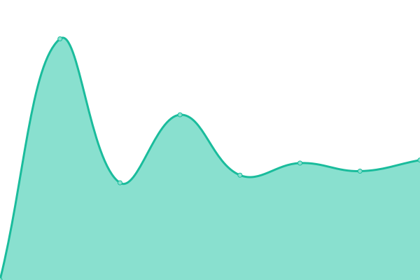

# [Status page](https://tiktok-status.nextpost.tech) for [Nextpost.tech](https://nextpost.tech)

This repository contains the open-source uptime monitor and status page for [Nextpost.tech](https://nextpost.tech), powered by [Upptime](https://github.com/upptime/upptime).

## [Live Status](https://tiktok-status.nextpost.tech): <!--live status--> **🟧 Partial outage**

<!--start: status pages-->
<!-- This summary is generated by Upptime (https://github.com/upptime/upptime) -->
<!-- Do not edit this manually, your changes will be overwritten -->
<!-- prettier-ignore -->
| URL | Status | History | Response Time | Uptime |
| --- | ------ | ------- | ------------- | ------ |
|  /getNoWatermarkUrl - Get non watermarked video url | 🟩 Up | [get-no-watermark-url-get-non-watermarked-video-url.yml](https://github.com/nextpost-tech/tiktok-status/commits/HEAD/history/get-no-watermark-url-get-non-watermarked-video-url.yml) | 

 4064ms
     
 | 

<a href="https://tiktok-status.nextpost.tech/history/get-no-watermark-url-get-non-watermarked-video-url">99.83%</a>
    

|  /getNoWatermarkUrlByID - Get non watermarked video url by video ID | 🟩 Up | [get-no-watermark-url-by-id-get-non-watermarked-video-url-by-video-id.yml](https://github.com/nextpost-tech/tiktok-status/commits/HEAD/history/get-no-watermark-url-by-id-get-non-watermarked-video-url-by-video-id.yml) | 

 614ms
     
 | 

<a href="https://tiktok-status.nextpost.tech/history/get-no-watermark-url-by-id-get-non-watermarked-video-url-by-video-id">100.00%</a>
    

|  /getVideoByID - Get video info by ID | 🟩 Up | [get-video-by-id-get-video-info-by-id.yml](https://github.com/nextpost-tech/tiktok-status/commits/HEAD/history/get-video-by-id-get-video-info-by-id.yml) | 

 1440ms
     
 | 

<a href="https://tiktok-status.nextpost.tech/history/get-video-by-id-get-video-info-by-id">100.00%</a>
    

|  /getVideoByUrl - Get video info by URL | 🟩 Up | [get-video-by-url-get-video-info-by-url.yml](https://github.com/nextpost-tech/tiktok-status/commits/HEAD/history/get-video-by-url-get-video-info-by-url.yml) | 

 2036ms
     
 | 

<a href="https://tiktok-status.nextpost.tech/history/get-video-by-url-get-video-info-by-url">100.00%</a>
    

|  /getUnshortenedUrl - Convert short TikTok video URL to full TikTok video URL | 🟩 Up | [get-unshortened-url-convert-short-tik-tok-video-url-to-full-tik-tok-video-url.yml](https://github.com/nextpost-tech/tiktok-status/commits/HEAD/history/get-unshortened-url-convert-short-tik-tok-video-url-to-full-tik-tok-video-url.yml) | 

 3111ms
     
 | 

<a href="https://tiktok-status.nextpost.tech/history/get-unshortened-url-convert-short-tik-tok-video-url-to-full-tik-tok-video-url">100.00%</a>
    

|  /getCommentsByUrl - Get comments list by video URL | 🟩 Up | [get-comments-by-url-get-comments-list-by-video-url.yml](https://github.com/nextpost-tech/tiktok-status/commits/HEAD/history/get-comments-by-url-get-comments-list-by-video-url.yml) | 

 2590ms
     
 | 

<a href="https://tiktok-status.nextpost.tech/history/get-comments-by-url-get-comments-list-by-video-url">100.00%</a>
    

|  /getCommentsByID - Get comments list by video ID | 🟩 Up | [get-comments-by-id-get-comments-list-by-video-id.yml](https://github.com/nextpost-tech/tiktok-status/commits/HEAD/history/get-comments-by-id-get-comments-list-by-video-id.yml) | 

 2370ms
     
 | 

<a href="https://tiktok-status.nextpost.tech/history/get-comments-by-id-get-comments-list-by-video-id">100.00%</a>
    

|  /searchUser - Search for user by keyword | 🟩 Up | [search-user-search-for-user-by-keyword.yml](https://github.com/nextpost-tech/tiktok-status/commits/HEAD/history/search-user-search-for-user-by-keyword.yml) | 

 1609ms
     
 | 

<a href="https://tiktok-status.nextpost.tech/history/search-user-search-for-user-by-keyword">100.00%</a>
    

|  /searchVideo - Search for video by keyword | 🟩 Up | [search-video-search-for-video-by-keyword.yml](https://github.com/nextpost-tech/tiktok-status/commits/HEAD/history/search-video-search-for-video-by-keyword.yml) | 

 3348ms
     
 | 

<a href="https://tiktok-status.nextpost.tech/history/search-video-search-for-video-by-keyword">100.00%</a>
    

|  /searchMusic - Search for music by keyword | 🟩 Up | [search-music-search-for-music-by-keyword.yml](https://github.com/nextpost-tech/tiktok-status/commits/HEAD/history/search-music-search-for-music-by-keyword.yml) | 

 1682ms
     
 | 

<a href="https://tiktok-status.nextpost.tech/history/search-music-search-for-music-by-keyword">100.00%</a>
    

|  /searchLive - Search for live by keyword | 🟩 Up | [search-live-search-for-live-by-keyword.yml](https://github.com/nextpost-tech/tiktok-status/commits/HEAD/history/search-live-search-for-live-by-keyword.yml) | 

 2548ms
     
 | 

<a href="https://tiktok-status.nextpost.tech/history/search-live-search-for-live-by-keyword">100.00%</a>
    

|  /searchHashtag - Search for hashtag by keyword | 🟩 Up | [search-hashtag-search-for-hashtag-by-keyword.yml](https://github.com/nextpost-tech/tiktok-status/commits/HEAD/history/search-hashtag-search-for-hashtag-by-keyword.yml) | 

 1728ms
     
 | 

<a href="https://tiktok-status.nextpost.tech/history/search-hashtag-search-for-hashtag-by-keyword">100.00%</a>
    

|  /getUserInfo - Get user info by profile URL or nickname (works only for users with non-empty media feed) | 🟩 Up | [get-user-info-get-user-info-by-profile-url-or-nickname-works-only-for-users-with-non-empty-media-feed.yml](https://github.com/nextpost-tech/tiktok-status/commits/HEAD/history/get-user-info-get-user-info-by-profile-url-or-nickname-works-only-for-users-with-non-empty-media-feed.yml) | 

 1864ms
     
 | 

<a href="https://tiktok-status.nextpost.tech/history/get-user-info-get-user-info-by-profile-url-or-nickname-works-only-for-users-with-non-empty-media-feed">100.00%</a>
    

|  /getUserInfoByID - Get user info by profile ID (works only for users with non-empty media feed) | 🟩 Up | [get-user-info-by-id-get-user-info-by-profile-id-works-only-for-users-with-non-empty-media-feed.yml](https://github.com/nextpost-tech/tiktok-status/commits/HEAD/history/get-user-info-by-id-get-user-info-by-profile-id-works-only-for-users-with-non-empty-media-feed.yml) | 

 2382ms
     
 | 

<a href="https://tiktok-status.nextpost.tech/history/get-user-info-by-id-get-user-info-by-profile-id-works-only-for-users-with-non-empty-media-feed">100.00%</a>
    

|  /getBasicUserInfo - Get user info by profile ID (works for all users) | 🟩 Up | [get-basic-user-info-get-user-info-by-profile-id-works-for-all-users.yml](https://github.com/nextpost-tech/tiktok-status/commits/HEAD/history/get-basic-user-info-get-user-info-by-profile-id-works-for-all-users.yml) | 

 1903ms
     
 | 

<a href="https://tiktok-status.nextpost.tech/history/get-basic-user-info-get-user-info-by-profile-id-works-for-all-users">100.00%</a>
    

|  /getUserFeed - Get user feed by profile URL or nickname | 🟩 Up | [get-user-feed-get-user-feed-by-profile-url-or-nickname.yml](https://github.com/nextpost-tech/tiktok-status/commits/HEAD/history/get-user-feed-get-user-feed-by-profile-url-or-nickname.yml) | 

 1704ms
     
 | 

<a href="https://tiktok-status.nextpost.tech/history/get-user-feed-get-user-feed-by-profile-url-or-nickname">100.00%</a>
    

|  /getUserFeedByID - Get user feed by profile ID | 🟩 Up | [get-user-feed-by-id-get-user-feed-by-profile-id.yml](https://github.com/nextpost-tech/tiktok-status/commits/HEAD/history/get-user-feed-by-id-get-user-feed-by-profile-id.yml) | 

 2451ms
     
 | 

<a href="https://tiktok-status.nextpost.tech/history/get-user-feed-by-id-get-user-feed-by-profile-id">100.00%</a>
    

|  /getUserID - Get user ID by profile URL or nickname | 🟩 Up | [get-user-id-get-user-id-by-profile-url-or-nickname.yml](https://github.com/nextpost-tech/tiktok-status/commits/HEAD/history/get-user-id-get-user-id-by-profile-url-or-nickname.yml) | 

 564ms
     
 | 

<a href="https://tiktok-status.nextpost.tech/history/get-user-id-get-user-id-by-profile-url-or-nickname">100.00%</a>
    

|  /getUsernameByID - Get username by TikTok user ID | 🟩 Up | [get-username-by-id-get-username-by-tik-tok-user-id.yml](https://github.com/nextpost-tech/tiktok-status/commits/HEAD/history/get-username-by-id-get-username-by-tik-tok-user-id.yml) | 

 1975ms
     
 | 

<a href="https://tiktok-status.nextpost.tech/history/get-username-by-id-get-username-by-tik-tok-user-id">100.00%</a>
    

|  /getTwitterUsername - Get Twitter username by profile URL, nickname or TikTok user ID | 🟩 Up | [get-twitter-username-get-twitter-username-by-profile-url-nickname-or-tik-tok-user-id.yml](https://github.com/nextpost-tech/tiktok-status/commits/HEAD/history/get-twitter-username-get-twitter-username-by-profile-url-nickname-or-tik-tok-user-id.yml) | 

 1973ms
     
 | 

<a href="https://tiktok-status.nextpost.tech/history/get-twitter-username-get-twitter-username-by-profile-url-nickname-or-tik-tok-user-id">100.00%</a>
    

|  /getInstagramUsername - Get Instagram username by profile URL, nickname or TikTok user ID | 🟩 Up | [get-instagram-username-get-instagram-username-by-profile-url-nickname-or-tik-tok-user-id.yml](https://github.com/nextpost-tech/tiktok-status/commits/HEAD/history/get-instagram-username-get-instagram-username-by-profile-url-nickname-or-tik-tok-user-id.yml) | 

 2010ms
     
 | 

<a href="https://tiktok-status.nextpost.tech/history/get-instagram-username-get-instagram-username-by-profile-url-nickname-or-tik-tok-user-id">100.00%</a>
    

|  /getYoutubeChannel - Get YouTube channel info by profile URL, nickname or TikTok user ID | 🟩 Up | [get-youtube-channel-get-you-tube-channel-info-by-profile-url-nickname-or-tik-tok-user-id.yml](https://github.com/nextpost-tech/tiktok-status/commits/HEAD/history/get-youtube-channel-get-you-tube-channel-info-by-profile-url-nickname-or-tik-tok-user-id.yml) | 

 2296ms
     
 | 

<a href="https://tiktok-status.nextpost.tech/history/get-youtube-channel-get-you-tube-channel-info-by-profile-url-nickname-or-tik-tok-user-id">100.00%</a>
    

|  /getFollowers - Get user followers by profile URL or nickname | 🟩 Up | [get-followers-get-user-followers-by-profile-url-or-nickname.yml](https://github.com/nextpost-tech/tiktok-status/commits/HEAD/history/get-followers-get-user-followers-by-profile-url-or-nickname.yml) | 

 1868ms
     
 | 

<a href="https://tiktok-status.nextpost.tech/history/get-followers-get-user-followers-by-profile-url-or-nickname">100.00%</a>
    

|  /getFollowersByID - Get user followers by profile ID | 🟩 Up | [get-followers-by-id-get-user-followers-by-profile-id.yml](https://github.com/nextpost-tech/tiktok-status/commits/HEAD/history/get-followers-by-id-get-user-followers-by-profile-id.yml) | 

 1788ms
     
 | 

<a href="https://tiktok-status.nextpost.tech/history/get-followers-by-id-get-user-followers-by-profile-id">100.00%</a>
    

|  /getFollowing - Get user following by profile URL or nickname | 🟥 Down | [get-following-get-user-following-by-profile-url-or-nickname.yml](https://github.com/nextpost-tech/tiktok-status/commits/HEAD/history/get-following-get-user-following-by-profile-url-or-nickname.yml) | 

 1202ms
     
 | 

<a href="https://tiktok-status.nextpost.tech/history/get-following-get-user-following-by-profile-url-or-nickname">100.00%</a>
    

|  /getFollowingByID - Get user following by profile ID | 🟥 Down | [get-following-by-id-get-user-following-by-profile-id.yml](https://github.com/nextpost-tech/tiktok-status/commits/HEAD/history/get-following-by-id-get-user-following-by-profile-id.yml) | 

 1182ms
     
 | 

<a href="https://tiktok-status.nextpost.tech/history/get-following-by-id-get-user-following-by-profile-id">100.00%</a>
    

|  /getHashtagInfo - Get hashtag info by URL or tag name | 🟥 Down | [get-hashtag-info-get-hashtag-info-by-url-or-tag-name.yml](https://github.com/nextpost-tech/tiktok-status/commits/HEAD/history/get-hashtag-info-get-hashtag-info-by-url-or-tag-name.yml) | 

 1494ms
     
 | 

<a href="https://tiktok-status.nextpost.tech/history/get-hashtag-info-get-hashtag-info-by-url-or-tag-name">100.00%</a>
    

|  /getHashtagFeed - Get hashtag feed by URL or tag name | 🟥 Down | [get-hashtag-feed-get-hashtag-feed-by-url-or-tag-name.yml](https://github.com/nextpost-tech/tiktok-status/commits/HEAD/history/get-hashtag-feed-get-hashtag-feed-by-url-or-tag-name.yml) | 

 3257ms
     
 | 

<a href="https://tiktok-status.nextpost.tech/history/get-hashtag-feed-get-hashtag-feed-by-url-or-tag-name">100.00%</a>
    

|  /getHashtagFeedByID - Get hashtag feed by ID | 🟥 Down | [get-hashtag-feed-by-id-get-hashtag-feed-by-id.yml](https://github.com/nextpost-tech/tiktok-status/commits/HEAD/history/get-hashtag-feed-by-id-get-hashtag-feed-by-id.yml) | 

 2607ms
     
 | 

<a href="https://tiktok-status.nextpost.tech/history/get-hashtag-feed-by-id-get-hashtag-feed-by-id">99.99%</a>
    

|  /getMusicInfo - Get music info by URL or ID | 🟥 Down | [get-music-info-get-music-info-by-url-or-id.yml](https://github.com/nextpost-tech/tiktok-status/commits/HEAD/history/get-music-info-get-music-info-by-url-or-id.yml) | 

 1364ms
     
 | 

<a href="https://tiktok-status.nextpost.tech/history/get-music-info-get-music-info-by-url-or-id">99.99%</a>
    

|  /getMusicFeed - Get music feed by URL or ID | 🟥 Down | [get-music-feed-get-music-feed-by-url-or-id.yml](https://github.com/nextpost-tech/tiktok-status/commits/HEAD/history/get-music-feed-get-music-feed-by-url-or-id.yml) | 

 2452ms
     
 | 

<a href="https://tiktok-status.nextpost.tech/history/get-music-feed-get-music-feed-by-url-or-id">99.99%</a>
    

<!--end: status pages-->

[**Visit our status website →**](https://tiktok-status.nextpost.tech)
